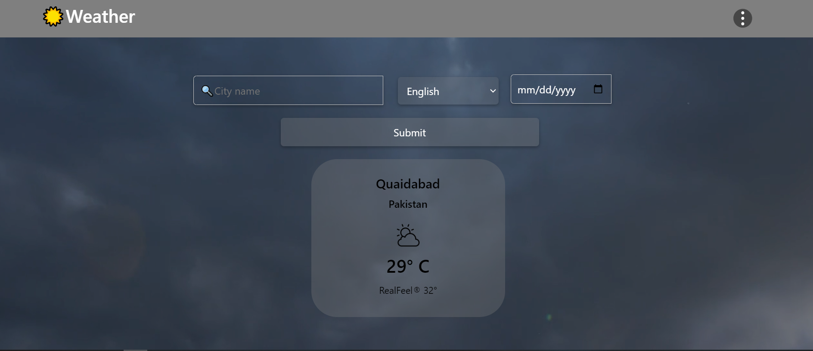
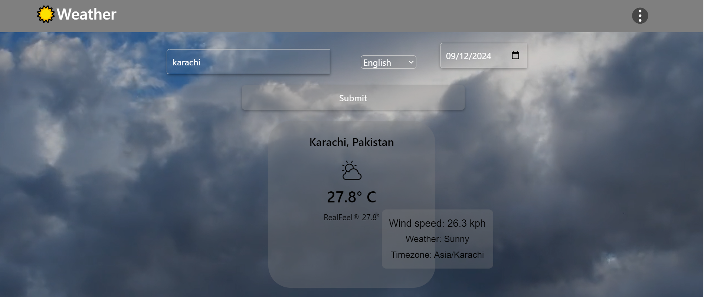

# Weather App 🌤

This is a weather application that allows users to search for historical weather data based on the city name, language, and date. The app fetches data from the Weather API and displays it dynamically on the page.

## Features
- Search for weather by city name.
- Choose a preferred language from a dropdown menu.
- Select a specific date to get historical weather data.
- Displays temperature, real feel, wind speed, and weather conditions.
- A toggleable settings menu for additional weather features.

## Technologies Used
- **HTML5**: For the structure and layout of the application.
- **CSS3 & Bootstrap**: For styling and responsive design.
- **JavaScript**: To handle user interactions and fetch data from the API.
- **Weather API**: Fetches historical weather data.

## API Used
- **Weather API**: This app uses the Weather API to fetch weather data for specific cities. You can learn more about the Weather API [here](https://rapidapi.com/weatherapi/api/weatherapi-com).

### Example API Request:
- Replace `{cityName}` with the name of the city you want to fetch weather for.
- Replace `{languageCode}` with the language code (e.g., `en` for English, `ur` for Urdu).
- Replace `{date}` with the desired date in the format `YYYY-MM-DD`.

## How to Run the Project
1. Clone the repository:
    ```
    git clone https://github.com/your-repo/weather-app.git
    ```
2. Open the project folder:
    ```
    cd weather-app
    ```
3. Open `index.html` in a web browser.

## Project Structure

## Future Improvements
- Display more weather parameters like humidity and pressure.
- Add current weather and future forecasts.
- Improve the UI/UX of the settings menu.

## Screenshots
### Main Screen


### Update Menu



## License

This project is licensed under the MIT License.
